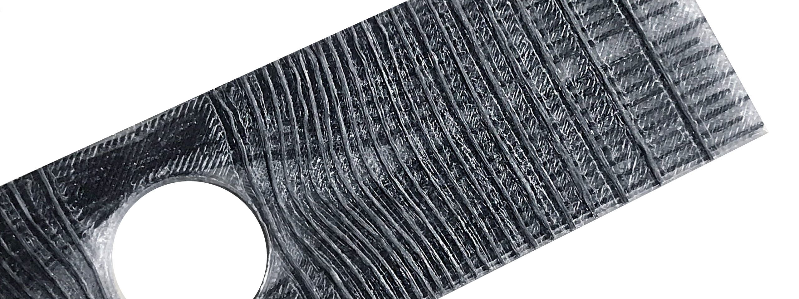

# Ariadne

Ariadne is a rational and adaptive irregular reinforcement algorithm. Like Ariadne's threads, the algorithm creates paths for reinforcing structural products that will be 3D printed.

Ariadne is a research project that allows you to maximize the potential of composite structures and materials. For example, to increase the bearing capacity of products, to change the mass and material consumption, to reduce the cost.

The project is a continuation of the master's thesis successfully completed in 2017 at BMSTU.

Theoretical research conducted by a group of scientists:
[Nikolay V. Zhivotenko](https://www.researchgate.net/profile/Nikolay-Zhivotenko), [Denis S. Vdovin](https://www.researchgate.net/profile/Denis-Vdovin), [Andrey V. Azarov](https://www.researchgate.net/profile/Andrey-Azarov-2), [Alexey R. Khaziev](https://www.researchgate.net/profile/Aleksey-Khaziev).

The algorithm was tested on the [Kirsch problem](https://en.wikipedia.org/wiki/Kirsch_equations), a classical problem of deformed solid mechanics, where it showed excellent results:

1. [Numerical modeling deflected mode in the typical construction of small-size spacecrafts from the composite material with rational reinforcement.](https://www.researchgate.net/publication/326902804_Numerical_modeling_deflected_mode_in_the_typical_construction_of_small-size_spacecrafts_from_the_composite_material_with_rational_reinforcement)
2. [Reinforcing an experimental sample with a hole to achieve uniform stress distribution without weight increase.](https://anisoprint.com/cases/reinforcing-composite-parts-with-holes/)

